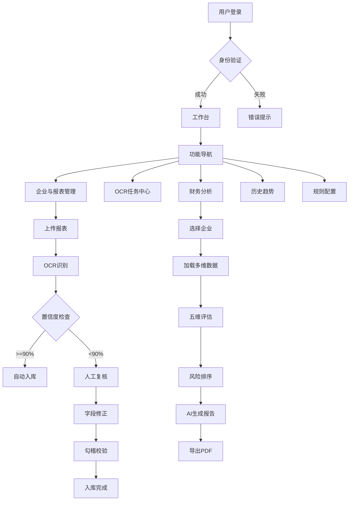

# 产品需求文档（PRD） - 鑫速录企业财务报表管理系统

## 1. 产品概述

**鑫速录**是一款面向中小企业和财务服务机构的企业财务报表自动化填报与智能分析平台。系统通过OCR技术自动识别财务报表数据，结合AI算法进行财务健康度评估和风险预警，帮助用户高效完成报表填报、审核和分析工作，提升财务管理效率和准确性。

**目标价值**：
- 将传统手工填报时间缩短80%以上
- 实现财务风险自动识别和预警
- 提供专业的财务分析报告和趋势监控

## 2. 核心功能

### 2.1 用户角色

| 角色 | 权限范围 | 核心功能 |
|------|----------|----------|
| 系统管理员 | 全部权限 | 企业管理、规则配置、系统设置、审计日志 |
| 财务分析师 | 数据查看与分析 | 报表查看、财务分析、趋势监控、报告导出 |
| 操作员 | 基础操作 | 报表上传、OCR复核、任务处理 |

### 2.2 功能模块

1. **登录认证模块**：用户登录、会话管理、权限控制
2. **工作台（A01）**：KPI指标展示、数据处理统计、待办任务列表
3. **企业与报表管理（A02）**：企业列表、报表管理、筛选搜索、批量操作
4. **报表详情/OCR复核（A03）**：三表展示、字段映射、置信度检查、勾稽校验
5. **财务分析报告（A04）**：五维雷达图、关键风险排序、AI分析摘要
6. **历史趋势监控（A05）**：多维度趋势图表、指标卡片、预警记录
7. **规则配置（A06）**：指标阈值配置、权重调整、规则治理

## 3. 页面功能详述

### 3.1 登录页面（Login.vue）
- **功能描述**：系统入口，用户身份验证
- **UI元素**：
  - 居中登录表单卡片
  - 系统Logo和名称"鑫速录"
  - 用户名输入框（默认值：admin）
  - 密码输入框（默认值：admin123）
  - 登录按钮（主色调）
  - 记住密码选项
- **交互逻辑**：
  - 表单验证（非空校验）
  - 登录成功跳转工作台
  - 错误提示信息显示

### 3.2 A01 工作台页面（Dashboard.vue）
- **功能描述**：系统首页，展示核心业务指标和待办事项
- **UI布局**：

#### 3.2.1 KPI卡片区域（4列网格）
| 卡片名称 | 指标内容 | 趋势标识 | 颜色方案 |
|---------|---------|---------|---------|
| 本月新增报表 | 86份 | ↑18.6% | 绿色上升箭头 |
| 待人工复核 | 12项 ↓4项高优先级 | 红色警告 | 红色警示 |
| OCR平均准确率 | 97.4% | ↑1.2pct | 绿色提升 |
| 高风险企业 | 9家 ↓较上月+2 | 橙色注意 | 橙色提醒 |

**KPI卡片样式**：
- 白色背景，14px圆角
- 阴影：0 5px 18px rgba(27,61,78,.06)
- 左侧彩色图标区域
- 右侧数值+趋势标签
- 悬停微动效（轻微上浮）

#### 3.2.2 图表区域（2列网格）

**左侧 - 报表处理量与通过率（双折线图）**：
- X轴：月份（近12个月）
- Y轴左：处理量（单位：份）
- Y轴右：通过率（百分比）
- 双折线：蓝色处理量曲线 + 绿色通过率曲线
- 数据点悬停提示
- 图例可切换显示

**右侧 - 风险等级分布（环形图）**：
- 环形图中心：总企业数
- 四个扇区：低风险（绿色）、中风险（黄色）、较高风险（橙色）、高风险（红色）
- 右侧图例：等级名称 + 数量 + 百分比
- 扇区点击交互（筛选对应企业）

#### 3.2.3 待处理任务表格
- 显示最近5条待办任务
- 列定义：任务编号、企业名称、任务类型、优先级、创建时间、状态
- 支持快速操作按钮（查看、处理）
- 底部"查看全部"链接

### 3.3 A02 企业与报表列表页（EnterpriseList.vue）
- **功能描述**：企业管理主界面，支持多维度筛选和数据导出

#### 3.3.1 顶部操作栏
- 左侧：导出Excel按钮（次要样式）
- 右侧：新增企业按钮（主色调）

#### 3.3.2 筛选工具栏
- 搜索框：企业名称/统一社会信用代码模糊查询
- 期间筛选：下拉选择（2024Q1-Q4、2025Q1...）
- 风险等级：多选标签（低/中/较高/高）
- 数据状态：下拉（已填报/待复核/已完成）

#### 3.3.3 数据表格
| 列名 | 字段说明 | 排序 | 宽度 |
|------|---------|------|------|
| 企业名称 | 可点击进入详情 | - | 180px |
| 最新报表期 | 格式：2025Q1 | 支持 | 120px |
| 三表状态 | 三色圆点图标组 | - | 150px |
| 健康度 | 百分比+进度条 | 支持 | 120px |
| 关键风险 | 标签云 | - | 200px |
| 客户经理 | 姓名 | 支持 | 100px |
| 更新时间 | 时间戳 | 支持 | 150px |
| 操作 | 查看/编辑/删除 | - | 150px |

**表格特性**：
- 字体大小：10px
- 斑马纹行背景
- 行悬停高亮
- 固定表头
- 空状态提示

#### 3.3.4 底部统计区域
- 统计文本："共126家企业 / 368期报表"
- 分页组件：每页10/20/50条可选
- 4个迷你统计卡片：
  - 已完成填报：98家
  - 待复核：18家
  - 高风险：9家
  - 本月新增：15家

### 3.4 A03 报表详情/OCR复核页（ReportDetail.vue）
- **功能描述**：单张报表的详细信息和OCR识别结果复核

#### 3.4.1 顶部信息栏
- 面包屑导航：企业与报表 > [企业名] > [报表期]
- 企业基本信息卡片：
  - 企业全称
  - 报表期间
  - 任务编号
  - 数据来源（扫描件/电子版）
  - 提交时间

#### 3.4.2 Tab切换区域
- Tab项：
  1. 资产负债表
  2. 利润表
  3. 现金流量表
  4. 校验结果汇总

#### 3.4.3 主内容区（左右分栏）

**左侧 - 字段映射表格（60%宽度）**：
| 列名 | 说明 | 特殊样式 |
|------|------|---------|
| 源科目 | OCR识别的原始科目名 | - |
| 源行次 | 报表中的行号 | 等宽字体 |
| 系统字段 | 映射后的标准字段名 | 可编辑下拉 |
| 置信度 | 百分比值 | 低置信度<80%黄色高亮 |

**低置信度字段标识**：
- 黄色背景 #fff8e1
- 警告图标 ⚠️
- 置信度数值红色显示
- 点击可展开详情

**右侧 - 详情面板（40%宽度）**：
- 选中字段详细信息
- 目标字段选择器（下拉+搜索）
- 勾稽校验结果展示：
  - 校验公式显示
  - 计算结果对比
  - 通过/不通过状态标识
  - 差异金额标红

### 3.5 A04 财务分析报告页（AnalysisReport.vue）
- **功能描述**：AI驱动的综合财务分析报告生成与展示

#### 3.5.1 顶部KPI指标卡（4个并排）
| 指标名称 | 当前值 | 行业均值 | 状态 |
|---------|--------|---------|------|
| 综合健康度 | 82.5分 | 75.0分 | 🟢 优秀 |
| 流动比率 | 1.85 | 1.50 | 🟢 正常 |
| 资产负债率 | 45.2% | 60.0% | 🟢 健康 |
| 经营现金流/收入 | 12.3% | 8.0% | 🟢 充裕 |

**样式特点**：
- 渐变背景卡片
- 数值大字号加粗
- 状态徽章（绿/黄/红）
- 与行业均值对比箭头

#### 3.5.2 分析图表区（2列网格）

**左侧 - 五维雷达图**：
- 五个维度：
  1. 偿债能力（权重25%）
  2. 盈利能力（权重25%）
  3. 运营效率（权重20%）
  4. 现金流状况（权重15%）
  5. 成长潜力（权重15%）
- 多边形填充：半透明品牌色
- 网格背景：浅灰色
- 数据点标记：实心圆点
- 悬停显示具体分数

**右侧 - 关键风险排序（列表）**：
- 红色左边框（4px）
- 卡片式列表项
- 每项包含：
  - 风险等级图标（🔴/🟠/🟡）
  - 风险描述标题
  - 影响程度说明
  - 建议措施摘要
- 按严重程度降序排列

#### 3.5.3 AI分析摘要文本区
- Markdown格式渲染
- 包含章节：
  - 总体评价
  - 优势分析
  - 风险提示
  - 改进建议
- 可复制全文按钮
- 导出PDF按钮

### 3.6 A05 历史趋势监控页（TrendMonitor.vue）
- **功能描述**：多时间维度的财务指标历史变化追踪

#### 3.6.1 顶部筛选栏
- 时间粒度切换：年度 / 季度 / 月度（单选按钮组）
- 时间范围：近3年 / 近5年（下拉选择）
- 企业选择：支持多选（下拉多选）
- 应用筛选按钮

#### 3.6.2 图表区域（2列网格）

**左侧 - 盈利能力趋势（折线图）**：
- 主指标：销售毛利率（%）
- X轴：时间节点
- Y轴：百分比0-100%
- 辅助线：行业平均水平虚线
- 区间标注：盈利/亏损区域底色
- 数据点悬停详情

**右侧 - 杠杆与流动性（双折线图）**：
- 折线1：资产负债率（%）
- 折线2：流动比率（倍数）
- 双Y轴设计
- 关键节点标注（如资产负债率>70%警告）
- 趋势预测虚线（未来2期）

#### 3.6.3 指标卡片区域（4列网格）
| 卡片 | 指标 | 当前值 | 趋势 | 同比变化 |
|-----|------|-------|------|---------|
| 卡片1 | 销售增长率 | 15.8% | ↑ | +3.2pct |
| 卡片2 | 销售毛利率 | 28.5% | ↑ | +1.8pct |
| 卡片3 | 资产负债率 | 45.2% | ↓ | -5.1pct |
| 卡片4 | 流动比率 | 1.85 | → | 持平 |

**卡片样式**：
- 迷你趋势图（sparkline）
- 环形进度指示器
- 颜色编码趋势箭头

#### 3.6.4 趋势预警记录表格
- 列：预警时间、指标名称、当前值、阈值、预警级别、处理状态
- 支持筛选：未处理/已处理/全部
- 分页显示
- 点击查看详情弹窗

### 3.7 A06 规则配置页（RuleConfig.vue）
- **功能描述**：财务指标阈值和风险评估规则的配置管理

#### 3.7.1 顶部操作栏
- 左侧：导入模板按钮（下载Excel模板）
- 右侧：新增规则按钮（弹出表单对话框）

#### 3.7.2 筛选工具栏
- 搜索框：规则名称/指标公式搜索
- 行业筛选：制造业/服务业/科技业/零售业...
- 企业规模：大型/中型/小型/微型
- 状态筛选：启用/停用/草稿

#### 3.7.3 规则配置表格
| 列名 | 说明 | 编辑方式 |
|------|------|---------|
| 指标名称 | 如"流动比率" | 文本 |
| 计算公式 | 如"流动资产/流动负债" | 只读展示 |
| 正常阈值 | 绿色区间 | 数字输入 |
| 关注阈值 | 黄色区间 | 数字输入 |
| 高风险阈值 | 红色区间 | 数字输入 | 
| 权重占比 | 滑块或数字 | 0-100% |
| 状态 | 启用/停用 | 开关 |
| 操作 | 编辑/删除/测试 | 按钮 |

**特殊交互**：
- 阈值输入实时预览效果
- 权重滑块拖动时其他规则权重自动调整
- 规则测试按钮：输入模拟值查看评级结果

#### 3.7.4 底部配置区域（2列网格）

**左侧 - 健康度权重配置**：
- 进度条可视化各维度权重
- 拖拽调整权重比例
- 实时计算权重总和（必须=100%）
- 保存配置按钮

**右侧 - 规则治理原则说明**：
- 文本说明区域
- 包含内容：
  - 评分方法论
  - 阈值设定依据
  - 行业对标标准
  - 更新维护规范
- 可折叠面板

## 4. 核心业务流程

### 4.1 报表填报流程
```
用户登录 → 上传报表 → OCR自动识别 → 字段映射 → 置信度检查 → 人工复核 → 勾稽校验 → 入库存储
```

### 4.2 财务分析流程
```
选择企业 → 加载历史数据 → 指标计算 → 风险评估 → 生成报告 → AI分析 → 导出分享
```

### 4.3 Mermaid流程图



## 5. 用户界面设计

### 5.1 设计风格

**整体风格**：专业商务风 + 科技感
- **主色调**：品牌绿 #0e8f78（代表增长、稳定、可信）
- **辅助色**：青绿色 #1dc7a3（用于强调和交互元素）
- **深色背景**：深蓝 #123044（导航栏、侧边栏）
- **文字颜色**：
  - 主文字：#10212b（深灰黑）
  - 次要文字：#6c7d89（中性灰）
- **边框颜色**：#dce6eb（浅灰蓝）
- **背景色**：
  - 页面背景：#eef3f7（极浅蓝灰）
  - 卡片背景：#ffffff（纯白）
- **语义色**：
  - 成功/正向：#20a96b（绿）
  - 警告/注意：#f3a83b（橙黄）
  - 危险/错误：#e35d6a（红）
  - 信息/提示：#3d7cf0（蓝）

**字体规范**：
- 中文主字体：PingFang SC / Microsoft YaHei
- 英文/数字：SF Pro Display / -apple-system
- 标题字重：600（Semi-bold）
- 正文字重：400（Regular）
- 标题字号：20px（一级）/ 16px（二级）/ 14px（三级）
- 正文字号：13px（正文）/ 12px（辅助）/ 10px（表格）

**组件风格**：
- 圆角：14px（卡片）/ 8px（按钮）/ 6px（输入框）
- 阴影：0 5px 18px rgba(27,61,78,.06)（卡片悬浮阴影）
- 按钮：圆角矩形，主按钮带渐变或纯色填充
- 图标：线性图标风格（Outlined），16px/20px尺寸
- 表格：紧凑型，10px字体，斑马纹行

### 5.2 页面设计概览

| 页面名称 | 核心模块 | UI元素特征 |
|---------|---------|-----------|
| 登录页 | 居中表单 | 品牌渐变背景、毛玻璃卡片、品牌Logo动画 |
| 工作台 | KPI+图表+表格 | 4格卡片网格、双图表并列、紧凑任务列表 |
| 企业列表 | 工具栏+表格+统计 | 顶部操作栏、多条件筛选、数据表格、底部统计卡 |
| 报表详情 | 信息栏+Tab+分栏 | 面包屑、Tab切换、左右分栏、字段高亮 |
| 分析报告 | KPI+图表+文本 | 渐变指标卡、雷达图、风险列表、Markdown渲染 |
| 趋势监控 | 筛选+图表+卡片+表 | 时间切换、双折线图、迷你趋势卡、预警表格 |
| 规则配置 | 工具栏+表格+配置 | 操作按钮、筛选栏、可编辑表格、进度条配置 |

### 5.3 响应式设计策略

**桌面优先（Desktop-first）**：
- 基准分辨率：1920×1080
- 最小支持：1366×768
- 内容区最大宽度：1440px（居中）
- 侧边栏固定宽度：210px
- 顶栏固定高度：66px

**响应式断点**：
- ≥1440px：完整布局（侧边栏+顶栏+内容区）
- 1200-1439px：内容区自适应收缩
- <1200px：隐藏部分次要信息，表格横向滚动

**适配要点**：
- 图表容器宽度100%，ECharts自动resize
- 表格超出横向滚动（保留关键列固定）
- KPI网格自动换行（4→2→1列）
- 移动端侧边栏收起为汉堡菜单（预留）

### 5.4 交互动效规范

**全局动效原则**：
- 过渡时长：200-300ms（快）/ 500ms（慢）
- 缓动函数：ease-out（出现）/ ease-in（消失）
- 动效目的：引导注意力、提供反馈、增强连贯性

**具体动效场景**：
1. **页面切换**：淡入淡出（opacity 0→1, 200ms）
2. **卡片悬停**：上浮+加深阴影（translateY -4px, shadow加强）
3. **按钮点击**：缩放反馈（scale 0.98, 100ms）
4. **数据加载**：骨架屏脉冲动画（skeleton shimmer）
5. **表格排序**：箭头旋转（180ms）
6. **弹窗出现**：从中心缩放+淡入（scale 0.95→1, opacity 0→1）
7. **Tab切换**：下划线滑动过渡（300ms ease）
8. **数字变化**：计数动画（number counter, 800ms）
9. **图表渲染**：柱状图生长、折线图绘制路径动画
10. **侧边栏菜单**：背景色滑动过渡（200ms）

## 6. 数据需求说明

### 6.1 Mock数据要求
由于后端API尚未完全对接，前端需要准备完整的Mock数据集：

**企业数据**（至少126条）：
- 企业名称、统一社会信用代码、行业分类、注册资本、成立日期
- 客户经理、联系方式、地址
- 最新报表期、填报状态、健康度评分
- 风险标签数组

**报表数据**（每企业多期）：
- 资产负债表数据（资产、负债、权益各大类及明细）
- 利润表数据（收入、成本、费用、利润等）
- 现金流量表数据（经营、投资、筹资活动现金流）
- OCR识别原始数据和置信度

**分析数据**：
- 五维评分（偿债、盈利、运营、现金流、成长）
- 历史趋势数据（按月/季度/年度的指标序列）
- 风险事件记录
- AI分析文本

**规则配置数据**：
- 指标定义、计算公式、阈值区间
- 权重配置
- 行业基准值

### 6.2 API接口预期（详见技术架构文档）
所有数据通过RESTful API获取，前端负责：
- 请求封装（Axios拦截器）
- 错误处理（统一提示）
- Loading状态管理
- 数据缓存策略（Vuex）
