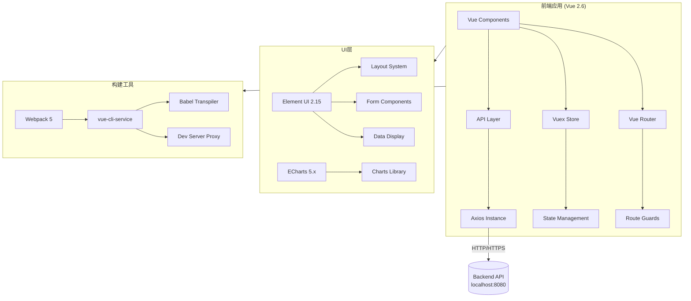
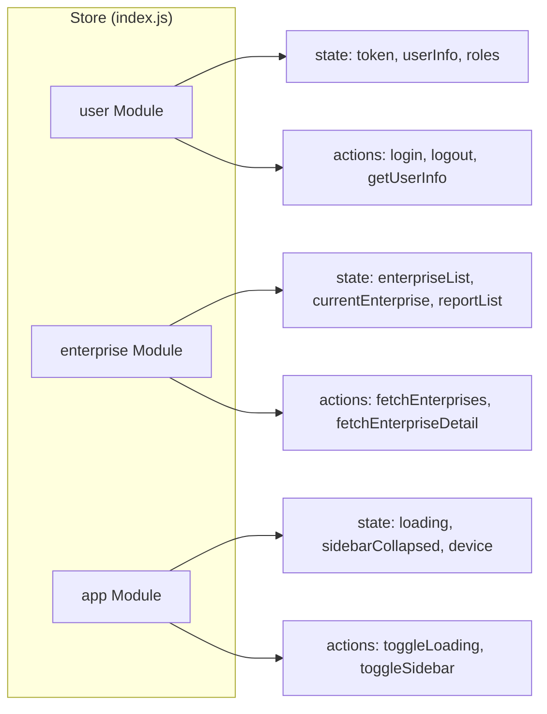

# 技术架构文档 - 鑫速录企业财务报表管理系统前端

## 1. 架构设计

### 1.1 整体架构图



### 1.2 目录结构详解

```
frontend/
├── public/                     # 静态资源目录
│   └── index.html              # HTML入口文件
│
├── src/                        # 源代码根目录
│   ├── api/                    # API请求模块层
│   │   ├── auth.js             # 认证相关API（登录、登出、token刷新）
│   │   ├── enterprise.js       # 企业管理API（CRUD、列表、详情）
│   │   ├── report.js           # 报表API（上传、获取、更新）
│   │   ├── ocr.js              # OCR相关API（识别结果、复核）
│   │   ├── indicator.js        # 指标计算API（获取指标数据）
│   │   ├── analysis.js         # 分析报告API（生成、获取报告）
│   │   ├── trend.js            # 趋势数据API（历史数据、预测）
│   │   └── dashboard.js        # 工作台API（KPI、统计数据）
│   │
│   ├── assets/                 # 静态资源文件
│   │   └── styles/             # 全局样式
│   │       ├── variables.css   # CSS变量定义（Design Tokens）
│   │       └── global.css      # 全局样式、重置样式、通用类
│   │
│   ├── components/             # 可复用组件库
│   │   ├── Layout/             # 布局组件
│   │   │   ├── AppSidebar.vue      # 左侧导航栏（210px宽，深蓝背景）
│   │   │   ├── AppHeader.vue       # 顶部栏（66px高，白色背景）
│   │   │   └── MainLayout.vue      # 主布局容器（组合Header+Sidebar+Content）
│   │   │
│   │   ├── charts/             # 图表组件（基于ECharts封装）
│   │   │   ├── LineChart.vue      # 折线图组件（支持单/双Y轴）
│   │   │   ├── BarChart.vue       # 柱状图组件（支持堆叠、分组）
│   │   │   ├── PieChart.vue       # 饼图/环形图组件
│   │   │   └── RadarChart.vue     # 雷达图组件（五维评分）
│   │   │
│   │   ├── KpiCard.vue            # KPI指标卡片（数值+趋势+图标）
│   │   ├── DataTable.vue          # 通用数据表格（分页、排序、筛选）
│   │   ├── StatusTag.vue          # 状态标签（多色变体）
│   │   └── ProgressBar.vue        # 进度条组件（多种样式）
│   │
│   ├── layout/                 # 布局相关配置（预留扩展）
│   │
│   ├── router/                 # 路由配置
│   │   └── index.js            # 路由定义、守卫、懒加载
│   │
│   ├── store/                  # Vuex状态管理
│   │   ├── index.js            # Store入口、插件配置
│   │   └── modules/
│   │       ├── user.js         # 用户状态（登录信息、权限）
│   │       ├── enterprise.js   # 企业数据状态
│   │       └── app.js          # 应用全局状态（Loading、主题等）
│   │
│   ├── utils/                  # 工具函数库
│   │   ├── request.js          # Axios实例封装（拦截器、错误处理）
│   │   ├── format.js           # 格式化函数（金额、百分比、日期）
│   │   └── validate.js         # 表单验证规则
│   │
│   ├── views/                  # 页面视图组件
│   │   ├── Login.vue           # 登录页面
│   │   ├── Dashboard.vue       # A01工作台
│   │   ├── EnterpriseList.vue  # A02企业与报表列表
│   │   ├── ReportDetail.vue    # A03报表详情/OCR复核
│   │   ├── AnalysisReport.vue  # A04财务分析报告
│   │   ├── TrendMonitor.vue    # A05历史趋势监控
│   │   └── RuleConfig.vue      # A06指标与规则配置
│   │
│   ├── App.vue                 # 根组件
│   └── main.js                 # 应用入口（初始化Vue、Router、Store、UI库）
│
├── package.json                # 项目依赖配置
├── vue.config.js              # Webpack配置（代理、别名、优化）
├── .env.development           # 开发环境变量
├── .env.production            # 生产环境变量（预留）
└── .gitignore                 # Git忽略规则
```

## 2. 技术栈详细说明

### 2.1 核心框架版本

| 技术 | 版本 | 用途 | 选择理由 |
|------|------|------|---------|
| Vue | 2.6.14 | 核心框架 | 稳定版本，长期支持，Options API成熟生态 |
| Vue Router | ^3.5.4 | 路由管理 | Vue 2官方路由解决方案，支持懒加载、守卫 |
| Vuex | ^3.6.2 | 状态管理 | 集中式状态管理，适合中型应用 |
| Axios | ^0.27.2 | HTTP客户端 | Promise-based，拦截器机制完善 |
| Element UI | 2.15.14 | UI组件库 | Vue 2生态最成熟的组件库，企业级设计 |
| ECharts | ^5.4.3 | 图表库 | 功能强大，性能优秀，中文文档完善 |
| core-js | ^3.25.0 | Polyfill | ES6+语法兼容性支持 |

### 2.2 构建工具链

**构建工具**：@vue/cli-service 5.x（内部集成Webpack 5）

**Babel配置**：
- @babel/preset-env（自动检测目标浏览器）
- plugin-proposal-optional-chaining（可选链操作符）
- plugin-proposal-nullish-coalescing（空值合并运算符）

**PostCSS配置**：
- autoprefixer（自动添加浏览器前缀）
- postcss-preset-env（现代CSS特性支持）

**开发依赖**：
- sass/sass-loader（SCSS支持，如需使用）
- eslint + prettier（代码规范，可选配置）

### 2.3 开发环境配置

**Node.js版本要求**：≥14.x（推荐16.x或18.x）

**包管理器**：npm 或 yarn 或 pnpm（任选其一）

## 3. 路由定义

### 3.1 路由配置表

| 路由路径 | 组件名称 | 路由名称 | 是否需要认证 | 布局类型 | 说明 |
|---------|---------|---------|------------|---------|------|
| `/login` | Login | login | 否 | 无布局（独立页） | 登录页 |
| `/` | Dashboard | dashboard | 是 | MainLayout | 工作台（默认首页） |
| `/enterprise` | EnterpriseList | enterprise | 是 | MainLayout | 企业与报表列表 |
| `/enterprise/:id` | ReportDetail | report-detail | 是 | MainLayout | 报表详情/OCR复核 |
| `/analysis` | AnalysisReport | analysis | 是 | MainLayout | 财务分析报告 |
| `/trend` | TrendMonitor | trend | 是 | MainLayout | 历史趋势监控 |
| `/rule-config` | RuleConfig | rule-config | 是 | MainLayout | 规则配置 |

### 3.2 路由守卫逻辑

```javascript
// 伪代码 - 路由守卫流程
router.beforeEach((to, from, next) => {
  // 1. 检查目标路由是否需要认证
  if (to.meta.requiresAuth) {
    // 2. 检查本地存储是否有有效token
    const token = localStorage.getItem('token')
    
    if (token) {
      // 3. token存在，验证是否过期（可选：调用后端接口验证）
      next() // 放行
    } else {
      // 4. 无token，重定向到登录页
      next({
        path: '/login',
        query: { redirect: to.fullPath } // 保存原目标路径
      })
    }
  } else {
    // 5. 公开页面直接放行
    // 特殊处理：已登录用户访问login页时重定向到首页
    if (to.path === '/login' && localStorage.getItem('token')) {
      next({ path: '/' })
    } else {
      next()
    }
  }
})
```

### 3.3 路由懒加载策略

```javascript
// 使用动态import实现组件懒加载
const Dashboard = () => import(/* webpackChunkName: "dashboard" */ '@/views/Dashboard.vue')
const EnterpriseList = () => import(/* webpackChunkName: "enterprise" */ '@/views/EnterpriseList.vue')
// ... 其他页面类似
```

**打包优化**：
- 每个主要页面单独打包成chunk
- 第三方库（Element UI、ECharts）提取为vendor chunk
- 利用浏览器缓存，减少首屏加载时间

## 4. API接口定义

### 4.1 Axios实例配置

**基础配置**（utils/request.js）：
```javascript
// 开发环境
baseURL: '/api'  // 通过vue.config.js代理到 localhost:8080

// 生产环境
baseURL: process.env.VUE_APP_BASE_API || '/api'

// 超时设置
timeout: 15000  // 15秒

// 请求头
headers: {
  'Content-Type': 'application/json',
  'X-Requested-With': 'XMLHttpRequest'
}
```

### 4.2 请求拦截器

```javascript
// 伪代码
axios.interceptors.request.use(config => {
  // 1. 从Vuex Store或localStorage获取token
  const token = store.getters.token || localStorage.getItem('token')
  
  // 2. 如果token存在，添加到请求头
  if (token) {
    config.headers['Authorization'] = `Bearer ${token}`
  }
  
  // 3. 添加请求时间戳（防止缓存）
  if (config.method === 'get') {
    config.params = {
      ...config.params,
      _t: Date.now()
    }
  }
  
  // 4. 显示全局Loading（可选，根据配置）
  if (config.showLoading !== false) {
    store.dispatch('app/setLoading', true)
  }
  
  return config
}, error => {
  return Promise.reject(error)
})
```

### 4.3 响应拦截器

```javascript
// 伪代码
axios.interceptors.response.use(response => {
  // 1. 关闭Loading
  store.dispatch('app/setLoading', false)
  
  // 2. 检查业务状态码
  const res = response.data
  
  if (res.code === 200 || res.code === 0) {
    // 业务成功，返回数据
    return res.data
  } else if (res.code === 401) {
    // Token过期或无效
    MessageBox.confirm('登录已过期，请重新登录', '提示', {
      confirmButtonText: '重新登录',
      cancelButtonText: '取消',
      type: 'warning'
    }).then(() => {
      store.dispatch('user/logout').then(() => {
        location.reload() // 清除路由缓存
      })
    })
    return Promise.reject(new Error(res.message || '错误'))
  } else {
    // 其他业务错误
    Message({
      message: res.message || '请求失败',
      type: 'error',
      duration: 3000
    })
    return Promise.reject(new Error(res.message || '错误'))
  }
}, error => {
  // HTTP错误处理
  store.dispatch('app/setLoading', false)
  
  if (error.response) {
    switch (error.response.status) {
      case 400:
        Message.error('请求参数错误')
        break
      case 403:
        Message.error('没有权限访问')
        break
      case 404:
        Message.error('请求的资源不存在')
        break
      case 500:
        Message.error('服务器内部错误')
        break
      default:
        Message.error(`连接错误${error.response.status}`)
    }
  } else if (error.message.includes('timeout')) {
    Message.error('请求超时，请稍后重试')
  } else {
    Message.error('网络异常，请检查网络连接')
  }
  
  return Promise.reject(error)
})
```

### 4.4 API模块清单

#### auth.js - 认证模块
| 方法 | URL | 说明 | 参数 | 返回值 |
|------|-----|------|------|--------|
| POST | /auth/login | 用户登录 | {username, password} | {token, userInfo} |
| POST | /auth/logout | 用户登出 | - | {success: true} |
| GET | /auth/userinfo | 获取用户信息 | - | {roles, permissions, name} |
| POST | /auth/refresh-token | 刷新Token | {refreshToken} | {newToken} |

#### enterprise.js - 企业管理模块
| 方法 | URL | 说明 | 参数 | 返回值 |
|------|-----|------|------|--------|
| GET | /enterprises | 获取企业列表 | {page, size, keyword, riskLevel, status} | {list, total} |
| GET | /enterprises/:id | 获取企业详情 | id | {enterprise, reports} |
| POST | /enterprises | 新增企业 | {enterpriseData} | {id} |
| PUT | /enterprises/:id | 更新企业信息 | {id, enterpriseData} | {success} |
| DELETE | /enterprises/:id | 删除企业 | id | {success} |
| GET | /enterprises/export | 导出企业列表 | {filters} | Blob(Excel) |

#### report.js - 报表模块
| 方法 | URL | 说明 | 参数 | 返回值 |
|------|-----|------|------|--------|
| GET | /reports | 获取报表列表 | {enterpriseId, period, status} | {list, total} |
| GET | /reports/:id | 获取报表详情 | id | {report, ocrResult, fields} |
| POST | /reports/upload | 上传报表文件 | FormData | {taskId} |
| PUT | /reports/:id | 更新报表数据 | {id, fields} | {success} |
| POST | /reports/:id/submit | 提交报表审核 | id | {success} |

#### ocr.js - OCR模块
| 方法 | URL | 说明 | 参数 | 返回值 |
|------|-----|------|------|--------|
| GET | /ocr/tasks/:taskId | 获取OCR识别结果 | taskId | {fields, confidence} |
| POST | /ocr/tasks/:taskId/review | 提交人工复核 | {taskId, corrections} | {success} |
| GET | /ocr/tasks/:taskId/validation | 获取勾稽校验结果 | taskId | {validations, passed} |

#### indicator.js - 指标模块
| 方法 | URL | 说明 | 参数 | 返回值 |
|------|-----|------|------|--------|
| GET | /indicators/:enterpriseId | 获取企业指标 | enterpriseId, period | {indicators} |
| GET | /indicators/:enterpriseId/history | 获取历史指标 | enterpriseId, range | {timeline} |
| POST | /indicators/calculate | 手动触发计算 | {enterpriseId, period} | {jobId} |

#### analysis.js - 分析模块
| 方法 | URL | 说明 | 参数 | 返回值 |
|------|-----|------|------|--------|
| GET | /analysis/:enterpriseId | 获取分析报告 | enterpriseId, period | {report} |
| POST | /analysis/generate | 生成分析报告 | {enterpriseId, period} | {reportId} |
| GET | /analysis/:id/export | 导出报告PDF | id | Blob(PDF) |
| GET | /analysis/radar-data | 获取雷达图数据 | enterpriseId | {dimensions} |

#### trend.js - 趋势模块
| 方法 | URL | 说明 | 参数 | 返回值 |
|------|-----|------|------|--------|
| GET | /trend/:enterpriseId | 获取趋势数据 | enterpriseId, granularity, range | {series} |
| GET | /trend/alerts | 获取预警记录 | {enterpriseId, status, page} | {list, total} |
| GET | /trend/prediction | 获取趋势预测 | enterpriseId, indicators | {forecast} |

#### dashboard.js - 工作台模块
| 方法 | URL | 说明 | 参数 | 返回值 |
|------|-----|------|------|--------|
| GET | /dashboard/kpis | 获取KPI指标 | - | {kpis[]} |
| GET | /dashboard/chart-data | 获取图表数据 | {type, range} | {chartData} |
| GET | /dashboard/tasks | 获取待办任务 | {limit} | {tasks[]} |
| GET | /dashboard/statistics | 获取统计数据 | - | {stats} |

### 4.5 响应数据格式约定

**成功响应**：
```json
{
  "code": 200,
  "message": "success",
  "data": {
    // 实际数据
  },
  "timestamp": 1672531200000
}
```

**分页响应**：
```json
{
  "code": 200,
  "message": "success",
  "data": {
    "list": [...],
    "total": 126,
    "page": 1,
    "size": 10,
    "pages": 13
  }
}
```

**错误响应**：
```json
{
  "code": 400,
  "message": "参数错误：企业ID不能为空",
  "data": null,
  "timestamp": 1672531200000
}
```

## 5. Vuex状态管理设计

### 5.1 Store模块结构



### 5.2 user模块详细设计

**State**：
```javascript
{
  token: '',                    // 用户令牌（持久化到localStorage）
  userInfo: {},                 // 用户基本信息
  roles: [],                    // 用户角色列表
  permissions: []               // 权限点列表
}
```

**Getters**：
```javascript
{
  token: state => state.token || localStorage.getItem('token'),
  isLoggedIn: state => !!state.token,
  hasRole: state => role => state.roles.includes(role),
  hasPermission: state => permission => state.permissions.includes(permission)
}
```

**Actions**：
```javascript
{
  // 登录
  async login({ commit }, { username, password }) {
    const data = await authApi.login({ username, password })
    commit('SET_TOKEN', data.token)
    commit('SET_USER_INFO', data.userInfo)
    localStorage.setItem('token', data.token)
  },
  
  // 登出
  async logout({ commit }) {
    await authApi.logout()
    commit('SET_TOKEN', '')
    commit('SET_USER_INFO', {})
    localStorage.removeItem('token')
  },
  
  // 获取用户信息
  async getUserInfo({ commit }) {
    const data = await authApi.getUserInfo()
    commit('SET_USER_INFO', data)
    commit('SET_ROLES', data.roles)
    commit('SET_PERMISSIONS', data.permissions)
  }
}
```

**Mutations**：
```javascript
{
  SET_TOKEN(state, token) { state.token = token },
  SET_USER_INFO(state, info) { state.userInfo = info },
  SET_ROLES(state, roles) { state.roles = roles },
  SET_PERMISSIONS(state, perms) { state.permissions = perms }
}
```

### 5.3 enterprise模块详细设计

**State**：
```javascript
{
  list: [],                   // 企业列表数据
  total: 0,                   // 总数量
  currentEnterprise: null,    // 当前选中的企业
  currentReport: null,        // 当前查看的报表
  filters: {                  // 当前筛选条件
    keyword: '',
    riskLevel: [],
    status: '',
    period: ''
  },
  pagination: {               // 分页信息
    currentPage: 1,
    pageSize: 10
  }
}
```

**Getters**：
```javascript
{
  // 获取筛选后的企业列表
  filteredEnterprises: state => {
    let result = state.list
    if (state.filters.keyword) {
      result = result.filter(ent =>
        ent.name.includes(state.filters.keyword) ||
        ent.creditCode.includes(state.filters.keyword)
      )
    }
    // ... 其他筛选条件
    return result
  },
  
  // 高风险企业数量
  highRiskCount: state => 
    state.list.filter(ent => ent.riskLevel === 'high').length
}
```

### 5.4 app模块详细设计

**State**：
```javascript
{
  loading: false,              // 全局Loading状态
  sidebarCollapsed: false,     // 侧边栏是否折叠
  device: 'desktop',           // 设备类型 desktop/mobile
  errorLog: []                 // 错误日志
}
```

**Actions**：
```javascript
{
  toggleLoading({ commit }, status) {
    commit('SET_LOADING', status)
  },
  
  toggleSidebar({ commit }) {
    commit('TOGGLE_SIDEBAR')
  },
  
  addErrorLog({ commit }, log) {
    commit('ADD_ERROR_LOG', log)
  }
}
```

## 6. 组件设计与规范

### 6.1 布局组件层级

```
App.vue
└── MainLayout.vue
    ├── AppHeader.vue (固定顶部, z-index: 1000)
    │   ├── 折叠菜单按钮
    │   ├── 面包屑导航
    │   └── 用户信息下拉菜单
    │
    ├── AppSidebar.vue (固定左侧, z-index: 999)
    │   ├── Logo区域
    │   └── 菜单项列表（递归支持子菜单）
    │
    └── <router-view> (主内容区, padding: 20px 24px)
        └── 各页面组件
```

### 6.2 Props传递规范

**命名规则**：
- 使用camelCase命名props
- Boolean类型props以is/has/can开头
- 回调函数以on开头

**示例**：
```javascript
props: {
  // 基础数据
  title: {
    type: String,
    required: true
  },
  
  // 配置项
  options: {
    type: Array,
    default: () => []
  },
  
  // 状态控制
  isLoading: {
    type: Boolean,
    default: false
  },
  
  // 事件回调
  onChange: {
    type: Function,
    default: () => {}
  },
  
  // 尺寸控制
  chartHeight: {
    type: [String, Number],
    default: '400px'
  }
}
```

### 6.3 事件发射规范

**事件命名**：kebab-case
**常用事件**：
- `@update:value` - 值变更
- `@change` - 状态改变
- `@click:item` - 点击某项
- `@search` - 搜索操作
- `@pagination-change` - 分页变化
- `@sort-change` - 排序变化

### 6.4 图表组件封装规范

**ECharts组件通用Props**：
```javascript
props: {
  chartData: { type: Object, required: true },  // 图表数据
  height: { type: String, default: '400px' },   // 容器高度
  width: { type: String, default: '100%' },     // 容器宽度
  theme: { type: String, default: '' },          // 主题
  autoResize: { type: Boolean, default: true },  // 自动响应式
  showLoading: { type: Boolean, default: false } // 加载状态
}
```

**生命周期钩子**：
```javascript
mounted() {
  this.initChart()
  window.addEventListener('resize', this.handleResize)
},
beforeDestroy() {
  window.removeEventListener('resize', this.handleResize)
  if (this.chart) {
    this.chart.dispose()
  }
},
methods: {
  initChart() {
    this.chart = echarts.init(this.$refs.chartRef, this.theme)
    this.updateChart()
  },
  updateChart() {
    const option = this.buildOption() // 子类实现
    this.chart.setOption(option, true)
  },
  handleResize() {
    if (this.autoResize && this.chart) {
      this.chart.resize()
  }
  }
}
```

## 7. 性能优化策略

### 7.1 加载性能优化

**代码分割**：
- 路由级懒加载（每个页面独立chunk）
- 第三方库分离（vendor chunk）
- Element UI按需引入（减少体积30%+）

**资源优化**：
- 图片懒加载（v-lazy指令）
- 字体文件子集化（只包含使用的字符）
- Gzip/Brotli压缩（服务器端配置）

**缓存策略**：
- 长期缓存静态资源（hash文件名）
- Service Worker缓存API响应（可选）
- LocalStorage缓存用户偏好设置

### 7.2 运行时性能优化

**列表渲染优化**：
- 使用key属性（唯一标识符）
- 虚拟滚动（大数据量表格 > 1000条）
- 避免不必要的响应式数据（Object.freeze）

**计算优化**：
- 合理使用computed vs methods
- 防抖/节流（搜索、窗口resize）
- 减少watch深度监听

**图表性能**：
- 数据采样（超过1000数据点时降采样）
- Canvas渲染模式（大数据量时）
- 按需渲染（Tab切换时才初始化图表）

### 7.3 打包体积优化

**当前预估体积**（未优化）：
- Vendor bundle: ~1.2MB (Element UI + ECharts)
- Main bundle: ~200KB (应用代码)
- Total: ~1.4MB

**优化目标**：
- Vendor: ~600KB (按需引入+Tree-shaking)
- Main: ~150KB (代码分割+压缩)
- Total gzip: ~200KB

**优化措施**：
1. Element UI按需引入（babel-plugin-component）
2. ECharts按需引入（按需注册组件）
3. Moment.js替换为dayjs（轻量化日期库）
4. Lodash按需引入（lodash-es + babel-plugin-import）
5. 图片压缩（TinyPNG/WebP格式）
6. Source Map生产环境关闭

## 8. 安全性考虑

### 8.1 前端安全措施

**XSS防护**：
- 用户输入转义（Vue自动转义{{}}）
- v-html谨慎使用（必须 sanitize）
- CSP策略配置（限制脚本来源）

**CSRF防护**：
- Token存储在localStorage（非Cookie）
- 请求头添加自定义标识
- SameSite Cookie属性设置

**敏感信息保护**：
- Token加密存储（可选Base64编码）
- 密码输入框type="password"
- 日志脱敏（不打印敏感数据）

### 8.2 接口安全

**HTTPS强制**：生产环境必须使用HTTPS
**Token有效期**：建议2小时，支持刷新机制
**权限校验**：前后端双重校验（前端隐藏菜单，后端验证接口权限）
**防重复提交**：表单提交时禁用按钮+请求唯一标识

## 9. 测试策略

### 9.1 单元测试（推荐）

**测试框架**：Jest + Vue Test Utils
**覆盖目标**：
- Utils工具函数（100%覆盖）
- Vuex actions/mutations
- 组件方法
- 格式化函数

**示例**：
```javascript
describe('format.js', () => {
  test('金额格式化 - 千分位', () => {
    expect(formatMoney(1234567.89)).toBe('1,234,567.89')
  })
  
  test('负数金额显示红色', () => {
    expect(formatMoney(-1000)).toContain('color: red')
  })
})
```

### 9.2 E2E测试（可选）

**测试工具**：Cypress 或 Playwright
**核心流程**：
- 登录流程
- 企业列表CRUD
- 报表上传和OCR复核
- 分析报告生成和导出

## 10. 部署与运维

### 10.1 构建命令

```bash
# 开发环境运行
npm run serve
# 访问 http://localhost:8081

# 生产环境构建
npm run build
# 输出到 dist/ 目录

# 代码检查
npm run lint
```

### 10.2 环境变量配置

**.env.development**：
```env
VUE_APP_TITLE=鑫速录 - 开发环境
VUE_APP_BASE_API=/api
VUE_APP_ENV=development
```

**.env.production**：
```env
VUE_APP_TITLE=鑫速录
VUE_APP_BASE_API=https://api.xinsulu.com
VUE_APP_ENV=production
```

### 10.3 Nginx部署配置（参考）

```nginx
server {
    listen 80;
    server_name admin.xinsulu.com;
    
    root /usr/share/nginx/html;
    index index.html;
    
    # SPA路由支持
    location / {
        try_files $uri $uri/ /index.html;
    }
    
    # API反向代理
    location /api/ {
        proxy_pass http://backend:8080/;
        proxy_set_header Host $host;
        proxy_set_header X-Real-IP $remote_addr;
    }
    
    # 静态资源缓存
    location ~* \.(js|css|png|jpg|jpeg|gif|ico|svg)$ {
        expires 1y;
        add_header Cache-Control "public, immutable";
    }
    
    # Gzip压缩
    gzip on;
    gzip_types text/plain text/css application/json application/javascript text/xml;
    gzip_min_length 1000;
}
```

## 11. 开发规范与最佳实践

### 11.1 代码风格

**ESLint规则**（推荐）：
```javascript
{
  extends: [
    'plugin:vue/essential',
    '@vue/standard'
  ],
  rules: {
    'no-console': process.env.NODE_ENV === 'production' ? 'error' : 'off',
    'no-debugger': process.env.NODE_ENV === 'production' ? 'error' : 'off',
    'vue/max-attributes-per-line': ['error', {
      singleline: 3,
      multiline: 1
    }],
    'vue/html-indent': ['error', 2],
    'vue/component-name-in-template-casing': ['error', 'PascalCase']
  }
}
```

**Git提交规范**：
```
feat: 新功能
fix: 修复bug
docs: 文档更新
style: 代码格式调整（不影响功能）
refactor: 重构（不是新功能也不是修复bug）
perf: 性能优化
test: 测试相关
chore: 构建/工具链变动
```

### 11.2 组件开发规范

**单一职责**：每个组件只做一件事
**可复用性**：通过props和slots提高复用性
**命名语义化**：组件名清晰表达用途
**注释关键逻辑**：复杂业务逻辑必须有注释
**避免深层嵌套**：组件层级不超过3层

### 11.3 状态管理规范

**何时使用Vuex**：
- 跨组件共享的数据
- 需要持久化的数据
- 异步操作的结果
- 全局UI状态（loading、sidebar）

**何时不使用**：
- 仅组件内部使用的状态（用data）
- 不需要共享的临时状态
- 可以通过props/events传递的状态

## 12. 后续扩展预留

### 12.1 国际化（i18n）
- 预留vue-i18n集成点
- 语言包目录结构
- 中英文双语支持

### 12.2 主题定制
- CSS变量动态切换
- 暗黑模式支持
- 自定义品牌色配置

### 12.3 PWA支持
- Service Worker离线缓存
- 推送通知
- 安装到桌面

### 12.4 微信/移动端适配
- 响应式布局完善
- 触摸手势支持
- 微信SDK集成（如需）
